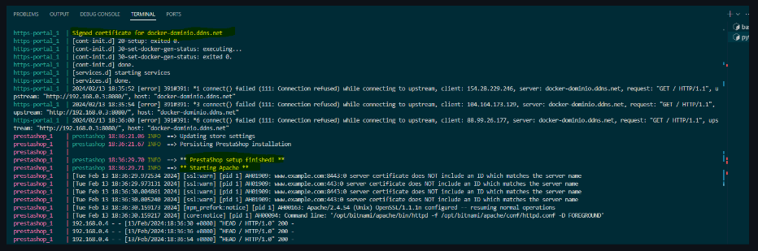

# Instalación de Prestashop a traves de docker con la imagen de bitnami.
## Creación de los respectivos contenedores para la instalación de wordpress.

### ¿Qué es docker?
Docker es una plataforma de código abierto diseñada para facilitar la creación, implementación y ejecución de aplicaciones en contenedores. Un contenedor se puede definir como un entorno ligero, aislado y portable, que contiene todo lo necesario (código fuente, dependencias, etc.) para ejecutar una aplicación, un contenedor suele tener un único procesos en ejecución, aunque es posible tener varios. Una de las ventajas que aporta el uso de contenedores es que garantiza que una aplicación se ejecute de la misma manera en cualquier entorno.

Comandos importantes de docker:
```
Trabajamos con un fichero llamado docker-compose.yml
-Para cargar dicho fichero usamos el comando:
docker-compose up

- Para ver el listado de las imagenes
docker images

- Para borrar las imagenes:
docker rmi -f <id_imagen>

- Para listar los volumenes 
docker volume ls

- Para borrar las volumenes:
docker-compose down -v

- Para ver el listado de los contenedores incluso los que se encuentran en segundo plano:
docker ps -a

- Para borrar los contenedores
docker rm -f <docker id>

```

### Trabajamos con un fichero docker-compose.yml
Por tanto lo vamos a explicar por parte.

#### Comenzamos con la parte de prestashop.
```
version: '3.3'

services:
 prestashop:
    image: bitnami/prestashop:1.7
    environment: 
      - PRESTASHOP_FIRST_NAME=${PRESTASHOP_FIRST_NAME}
      - PRESTASHOP_LAST_NAME=${PRESTASHOP_LAST_NAME}
      - PRESTASHOP_PASSWORD=${PRESTASHOP_PASSWORD}
      - PRESTASHOP_HOST=${DNS_DOMAIN_SECURE}
      - PRESTASHOP_EMAIL=${PRESTASHOP_EMAIL}
      - PRESTASHOP_COUNTRY=${PRESTASHOP_COUNTRY}
      - PRESTASHOP_DATABASE_HOST=mysql
      - PRESTASHOP_DATABASE_NAME=${PRESTASHOP_DATABASE_NAME}
      - ALLOW_EMPTY_PASSWORD=yes
      - PRESTASHOP_DATABASE_USER=${PRESTASHOP_DATABASE_USER}
      - PRESTASHOP_DATABASE_PASSWORD=${PRESTASHOP_DATABASE_PASSWORD}
      - PRESTASHOP_DATABASE_PREFIX=${PRESTASHOP_DATABASE_PREFIX}
      - PRESTASHOP_ENABLE_SSL=1
      - PRESTASHOP_ENABLE_HTTPS=yes
    volumes: 
      - prestashop_data:/bitnami/prestashop
    depends_on:
      - mysql
    restart: always
    networks:
      - frontend-network
      - backend-network
```

Que tenemos aquí...
La versión, la cual usa la versión de docker-compose: ``3``

Seguidamente comenzamos con el servicio de wordpress que contiene estas ips para la instalación.

Sacando la imagen de docker hub, usando la instalacion de prestashop de bitnami tenemos que trabajar con las etiquetas que nos ofrece esa ofrece esa imagen de wordpress, es necesario establecer la version en concreto con la que vamos a trabajar ``1.7``

En environment visualizamos las variables que contiene información sobre la instalación automatizada de wordpress.
Estas variables, para se exactos:

```
# Dominio.
DNS_DOMAIN_SECURE=docker-host.local

# Creación de las variables.
PRESTASHOP_FIRST_NAME=Bitnami
PRESTASHOP_LAST_NAME=User
PRESTASHOP_PASSWORD=bitnami1
PRESTASHOP_EMAIL=prestashop@prestashop.com
PRESTASHOP_COUNTRY=es
PRESTASHOP_LANGUAGE=es
PRESTASHOP_DATABASE_HOST=mysql
PRESTASHOP_DATABASE_NAME=prestashop
PRESTASHOP_DATABASE_USER=ps_user
PRESTASHOP_DATABASE_PASSWORD=ps_passwd
PRESTASHOP_DATABASE_PREFIX=ps_


MYSQL_ROOT_PASSWORD=root
```

Necesarios para la automatización de la instalación.

Se emplea tambien un volumen con nombre, para mantener la persistencia de datos, y que no se borren cuando se pare el contenedor.

Docker-compose, funciona con etiquetas, no hace falta poner ips este fichero ya creará las redes con la etiqueta frontend-network y backend-network, tambien hay que tener en cuenta que depende de que mysql este en funcionamiento.

#### Comenzamos la parte de la instalación de mysql.
  Como estamos trabajando con etiquetas, trabajamos siempre con nombres, ports...., image...., environment..., en el apartado environment disponemos de una serie de nombres donde debe incluirse con información el cual docker al ejecutarse, establecerá los parametros necesarios, traido a traves de unas variables, traidas desde nuestro fichero env

```
  mysql:
    image: mysql:8.0
    ports:
      - 3306:3306
    environment:
      - MYSQL_ROOT_PASSWORD=${MYSQL_ROOT_PASSWORD}
      - MYSQL_DATABASE=${PRESTASHOP_DATABASE_NAME}
      - MYSQL_USER=${PRESTASHOP_DATABASE_USER}
      - MYSQL_PASSWORD=${PRESTASHOP_DATABASE_PASSWORD}
    volumes:
      - mysql_data:/var/lib/mysql
    restart: always
    networks:
      - backend-network
    security_opt:
      - seccomp:unconfined
```   

Disponemos inclusive de un volumen el cual hace que el contenedor de mysql sea persistente, restart hace que se reinicia en caso de que el contenedor se tumbe, asignandole la red del backend.

Estableciendo unconfined para que no presenten restricciones en el contenedor.

Estas son las variables que usa:

```
PRESTASHOP_DATABASE_NAME=prestashop
PRESTASHOP_DATABASE_USER=ps_user
PRESTASHOP_DATABASE_PASSWORD=ps_passwd
```

Como podemos ver concuerda con las variables de la base de datos asignada a prestashop.

#### Comenzamos la parte de instalación de phpmyadmin.
```   
  phpmyadmin:
    image: phpmyadmin:5.2.1
    ports:
      - 8080:80
    environment: 
      - PMA_HOST=mysql
    restart: always
    networks:
      - frontend-network
      - backend-network
```

Aquí instala phpmyadmin tomando como host mysql y asignando las dos redes, las necesita para poder acceder a la base de datos desde el frontend, como comprobamos no le asignamos persistencia.

#### Comenzamos la parte de instalación de https en wordpress, para securizarlo.
```
  https-portal:
    image: steveltn/https-portal:1
    ports:
      - 80:80
      - 443:443
    restart: always
    environment:
      DOMAINS: '${DNS_DOMAIN_SECURE} -> http://prestashop:8080'
      STAGE: 'production' # Don't use production until staging works
      # FORCE_RENEW: 'true'
    networks:
      - frontend-network
```

En este caso, necesita los 80 y 443, http y https, http para que se pueda comunica con las otras maquinas, y https para que muestra el contenido de forma segura, encriptando las peticiones, es necesario usar la variable:

```
DNS_DOMAIN_SECURE=docker-dominio.ddns.net
```

Para acceder desde local, STAGE establecerlo en staging.
```
  https-portal:
    image: steveltn/https-portal:1
    ports:
      - 80:80
      - 443:443
    restart: always
    environment:
      DOMAINS: '${DNS_DOMAIN_SECURE} -> http://prestashop:8080'
      STAGE: 'production' # Don't use production until staging works
      # FORCE_RENEW: 'true'
    networks:
      - frontend-network
```

Como podemos ver en bitnami tanto para prestashop como wordpress los puertos son 8080 es necesario tenerlos abiertos en la máquina.

#### Parte de los volumenes y redes creadas durante la creación del fichero docker-compose.yml
```
volumes: 
  mysql_data:
  prestashop_data:
  ssl_certs_data:

networks:
  frontend-network:
  backend-network:
```

Es necesario crear, estas redes y volumenes al final para que se asigne de forma correcta a los docker.

## Comprobación de que funciona el fichero.

Comprobacion de que al lanzar el comando ``docker-compose up`` funcione.



Podemos comprobar que se ha ejecutado la instruccion correctamente y ya está prestashop instalado.

## Comprobación de que muestra el contenido via cliente web de forma segura.


Podemos comprobar que muestra el contenido de forma segura, encriptando las peticiones y respuestas entre cliente y servidor. El certificado es valido por una autoridad certificadora.

### Prueba de que funciona con un certificado autofirmado.